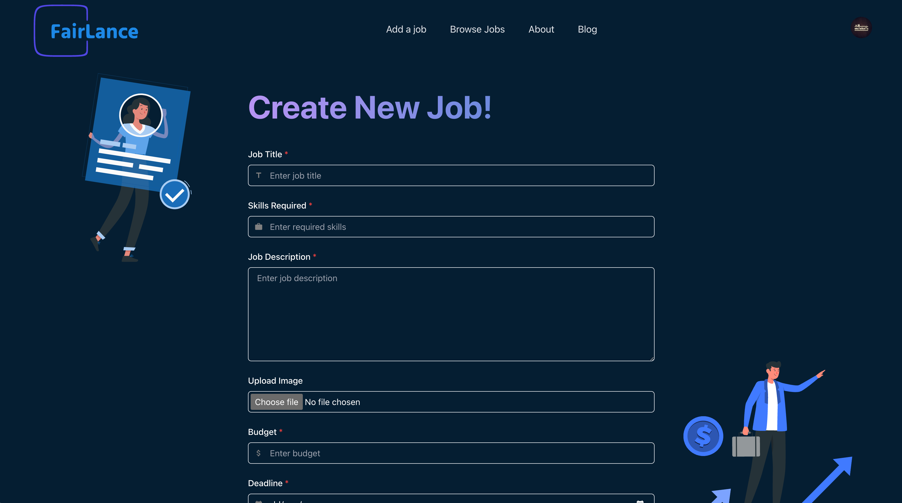

# 


**FairLance** is a decentralized freelancing platform that leverages blockchain technology to provide fair opportunities for freelancers worldwide. Utilizing Sui technologies, FairLance ensures secure, efficient, and transparent interactions for both freelancers and clients.

## 📚 Table of Contents

- [Introduction](#introduction)
- [Features](#features)
- [Technology Stack](#technology-stack)
- [Installation](#installation)
- [Usage](#usage)
- [Screen Shots](#screen-shots)
- [TODO](#todo)
- [License](#license)
- [Contact](#contact)

## 📝 Introduction

FairLance aims to revolutionize the freelancing industry by providing a platform that ensures fair opportunities for all freelancers globally. By leveraging blockchain technology, FairLance offers secure logins, decentralized job listings, and blockchain-based achievements, creating a transparent and efficient freelancing environment.

## ✨ Features

- **Secure Logins**: Utilizes ZKlogin (Zero Knowledge Proof) for easy and secure login.
- **Dwallet**: Seamless cross-chain crypto transfers without the need for bridging.
- **Decentralized Job Listings**: Ensures all jobs are added to the blockchain.
- **Sponsored Transactions**: Users don't need to worry about gas fees when interacting with smart contracts.
- **Blockchain-based Achievements**: Completed jobs are stored on the blockchain, guaranteeing content ownership and contributing to user achievements.
- **Airdrops**: Achievements help users earn prizes with airdrops of Sui’s favorite token FUD.

## 🛠 Technology Stack

- **Smart Contracts**: Move
- **Frontend**: Next.js, Tailwind CSS, ChakuraUI
- **Login**: ZKlogin (Zero Knowledge Proof)
- **Wallet**: dwallet

## 🚀 Installation

FairLance is deployed on Vercel but sadly I didn't have enough time to Deploy the contracts on SUI network it has been tested only on localnet!
To get started with FairLance, follow these steps:

1. **Clone the repository**:
    ```bash
    git clone https://github.com/your-username/FairLance.git
    ```

2. **Navigate to the project directory**:
    ```bash
    cd FairLance
    ```

3. **Install dependencies**:
    ```bash
    npm install
    ```

4. **Make sure to build and deploy the contracts**:
   for more info visit: [Sui Docs](https://docs.sui.io/guides/developer/getting-started/local-network)

## 💻 Usage

To start the development server, run:

```bash
npm run dev
```
This will launch the application locally. You can then open your browser and navigate to `http://localhost:3000` to see the platform in action.

## 📸 Screen Shots

# Home page
 

# Add a job page
 

# Browse jobs page
 

# Profile page
 


## ✅ TODO

- **Deploy Contracts**: We still need to deploy the contracts on Sui Network
- **Friendly usage of Dwallet**: Currently we integrated zkLogin with dWallet but the user doesn't have the visual control over his wallet
- **Replace Mock data**: Getting the jobs and adding jobs from chain
- **Achivment Board**: Adding Achivment Board and goals for users to get in FUD airdrop

## 📄 License

This project is licensed under the MIT License. See the [LICENSE](LICENSE) file for details.

## 📞 Contact

- **Mohammad Safi**
- **Email**: the.mohammad.safi@gmail.com
- **Website**: [FairLance Website](sui-overflow-hackathon.vercel.app)

Feel free to reach out if you have any questions or suggestions!

